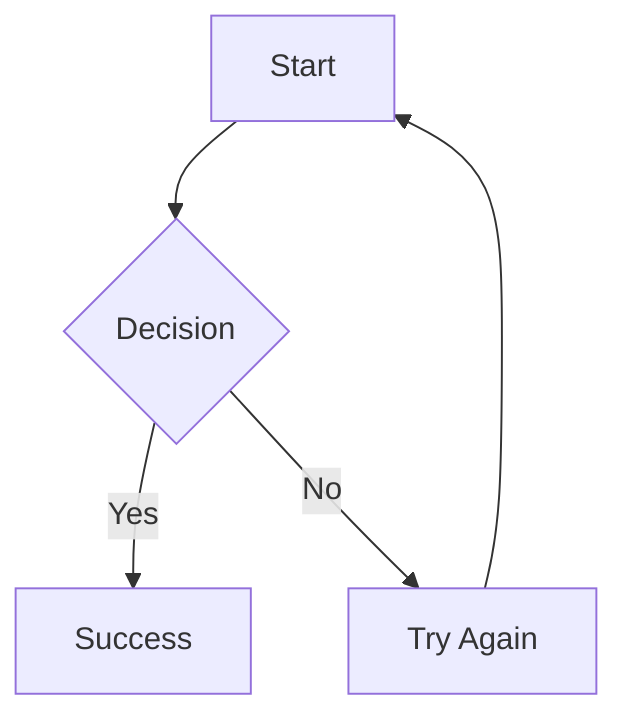
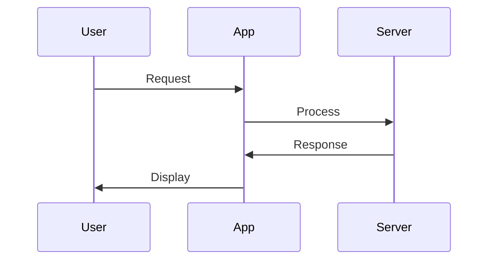

# MDViewer

A simple markdown viewer web application built with Go, using:
- **templ** for HTML templating
- **goldmark** for markdown processing with syntax highlighting
- **Pico CSS** for beautiful, semantic styling
- **urfave/cli/v2** for command-line interface

## Features

- 📁 **Case-insensitive file matching** - Access files without worrying about exact case
- 🎨 **Beautiful styling** with Pico CSS framework
- 🌓 **Dark/light mode** support automatically
- 🔍 **Syntax highlighting** for code blocks
- 📋 **GitHub Flavored Markdown** support including:
  - Tables
  - Task lists
  - Strikethrough
  - Auto-linking
  - Footnotes
  - Definition lists
- 📊 **Mermaid diagrams** with client-side rendering support:
  - Flowcharts
  - Sequence diagrams
  - Pie charts
  - Class diagrams
  - And all other Mermaid diagram types
- 📱 **Responsive design** works on mobile and desktop
- 🚀 **Fast and lightweight** - pure Go with minimal dependencies

## Installation

1. Clone or download this application
2. Install dependencies:
   ```bash
   go mod download
   ```
3. Generate templates:
   ```bash
   templ generate
   ```
4. Build the application:
   ```bash
   go build -o mdviewer
   ```

## Usage

### Basic usage
```bash
./mdviewer
```
This starts the server on port 8888 serving markdown files from the current directory.

### Custom directory and port
```bash
./mdviewer --dir /path/to/markdown/files --port 3000
```

### Command line options
- `--dir, -d`: Directory containing markdown files (default: current directory)
- `--port, -p`: Port to serve on (default: 8888)
- `--help, -h`: Show help

## Supported File Extensions

The application recognizes these markdown file extensions:
- `.md`
- `.markdown`
- `.mdown`
- `.mkd`
- `.mkdn`
- `.mdwn`
- `.mdtxt`
- `.mdtext`

## File Access

Files can be accessed via URLs without the markdown extension. For example:
- `README.md` → `http://localhost:8888/README`
- `docs/guide.md` → `http://localhost:8888/docs/guide`

The matching is case-insensitive, so `readme`, `README`, or `ReAdMe` will all match `README.md`.

## Mermaid Diagrams

MDViewer supports Mermaid diagrams with client-side rendering. Simply use fenced code blocks with the `mermaid` language:

### Flowchart Example
````markdown

````

### Sequence Diagram Example
````markdown

````

Diagrams are rendered client-side using MermaidJS, so no server-side processing is required. All diagram types supported by Mermaid are available.

## Example

1. Create some markdown files in a directory
2. Run the server: `./mdviewer --dir ./my-docs`
3. Open your browser to `http://localhost:8888`
4. Browse and view your markdown files with beautiful formatting!

## Development

To run in development mode with live reloading:
```bash
templ generate --watch --proxy="http://localhost:8888" --cmd="go run ."
```

This will:
- Watch for changes to `.templ` files and regenerate Go code
- Restart the server when Go files change
- Provide live browser reloading
